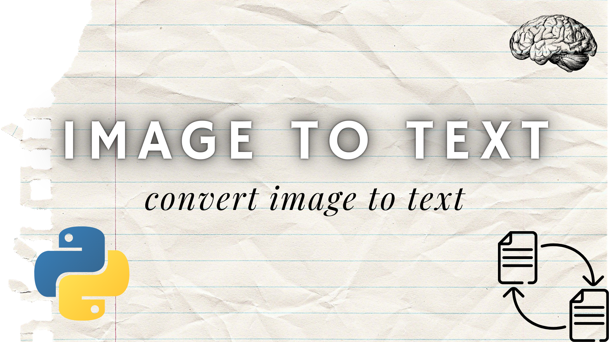

# 🖼️ Image to Text Converter (Desktop App)

This is a simple desktop application built with Python that allows users to extract text from images using Optical Character Recognition (OCR). It's perfect for practicing Python and learning how to build graphical user interfaces.

## 💡 Features

- Load image from file
- View image preview
- Extract text from image using Tesseract OCR
- Display extracted text
- Reset the app to load another image

## 📸 Screenshot

 <!-- Optional: Add a screenshot of the app here -->

## 🚀 Getting Started

### 1. Clone the repository

```bash
git clone https://github.com/macielphp/image-to-text.git
cd image-to-text
```

### 2. Install dependencies

Make sure Python 3 is installed. Then run:

```bash
pip install pillow pytesseract
```

### 3. Install Tesseract OCR

- **Windows:** Download and install from [Tesseract GitHub](https://github.com/tesseract-ocr/tesseract)
- **macOS:** Use Homebrew  
  ```bash
  brew install tesseract
  ```
- **Linux (Debian/Ubuntu):**
  ```bash
  sudo apt install tesseract-ocr
  ```

### 4. Set the Tesseract path in your script (if needed)

On Windows, change this line in the Python script:

```python
pytesseract.pytesseract.tesseract_cmd = r"C:\Program Files\Tesseract-OCR\tesseract.exe"
```

## 🧠 How to Use

1. Run the script:
   ```bash
   python app.py
   ```

2. Click “Select Image” to choose an image file.
3. Click “Convert” to extract the text.
4. The text will appear in the text area.
5. Click “Reset” to clear the image and text, and start again.

## 📁 Supported Image Formats

- `.png`
- `.jpg`
- `.jpeg`
- `.bmp`

## 🛠️ Built With

- Python
- Tkinter (GUI)
- Pillow (Image processing)
- Pytesseract (OCR engine)

## 📄 License

This project is licensed under the MIT License.

Feel free to improve the app or use it as a base for your own projects!